<div align="center">

# 🎧 Spotify Neo — Music Explorer

**A full-featured, multi-surface music streaming experience built with React, TypeScript & Redux.**

Aggregate real music from multiple open providers, play full tracks through a custom audio engine, build your library, and let the **AI DJ** and **Music DNA** engine read your taste — all wrapped in a polished, responsive interface.


</div>

---

## ✨ Highlights

- 🎵 **Real music, multiple sources** — searches and streams from **Audius**, **Jamendo** and **iTunes** in parallel, ranking full playable songs ahead of 30-second previews.
- 🔊 **Custom audio engine** — gapless playback, queue, shuffle, repeat, volume and progress control, wired through a dedicated playback core (not just an `<audio>` tag).
- 🖥️ **Multi-surface player** — a docked desktop player, an expandable Now Playing panel, a full-screen player, and a mobile mini-player + bottom navigation.
- 🤖 **AI DJ** — describe a vibe in plain language ("lofi beats for late-night coding") and get a generated queue tuned to it.
- 🧬 **Music DNA** — analyses your listening + likes into a shareable taste "personality" card with recommendations.
- 📚 **Your library** — like songs, build playlists, and jump back into recently played, all persisted locally.
- 📱 **Fully responsive** — desktop sidebar layout adapts to a mobile-first navigation with touch-friendly sheets.

---

## 🖼️ Screenshots

### Home / Discover
Personalised greeting, quick-pick tiles and horizontally scrolling shelves for recently played and new releases.

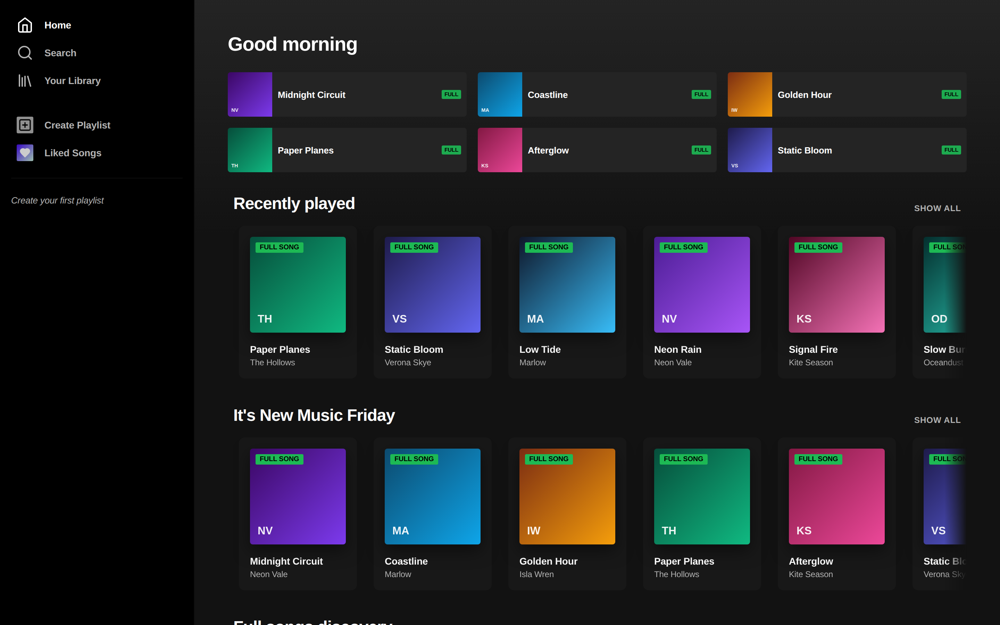

### Search
Aggregated results across providers with type filters (Full Songs, Artists, Playlists, Albums, Previews) and a Browse-all category grid.

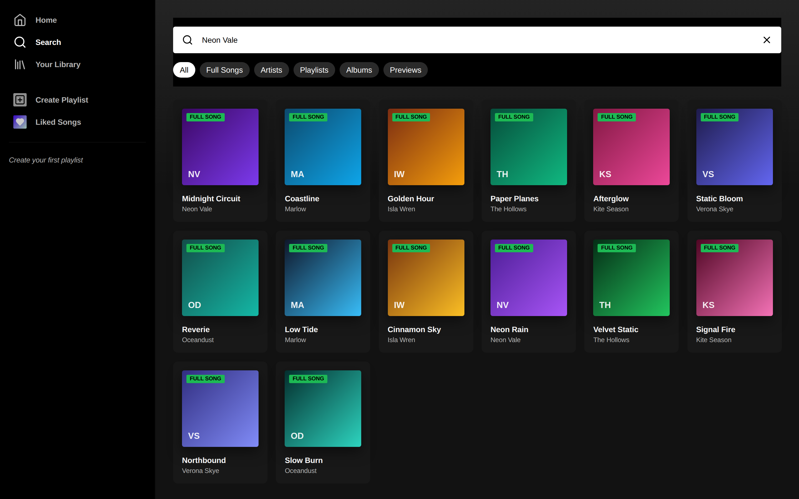

### Now Playing
A docked player with full transport controls, plus an expandable **Now Playing** panel showing artist info and credits.

| Docked player | Now Playing panel |
| :---: | :---: |
| 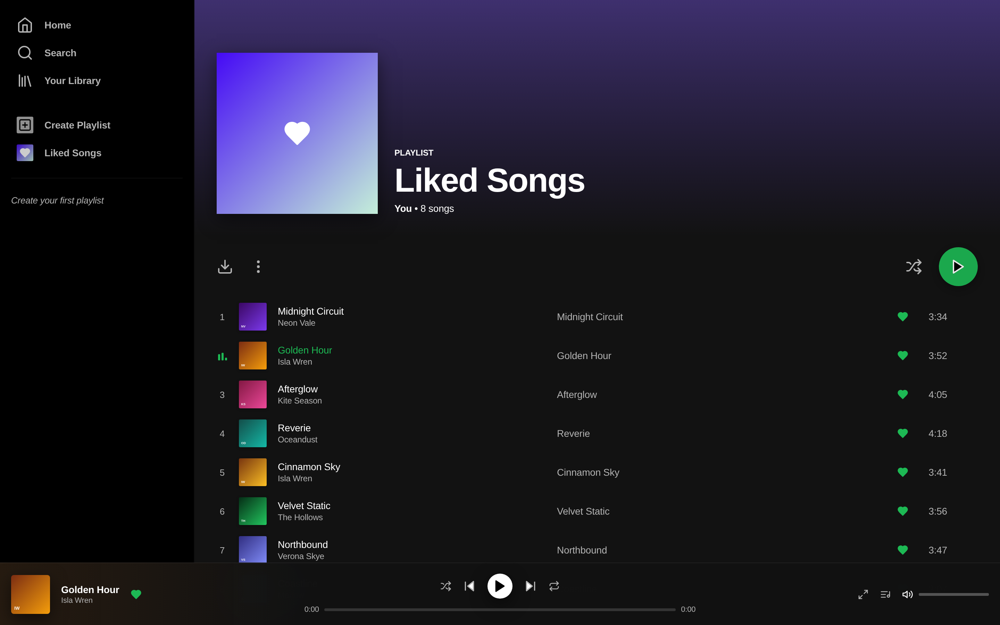 | 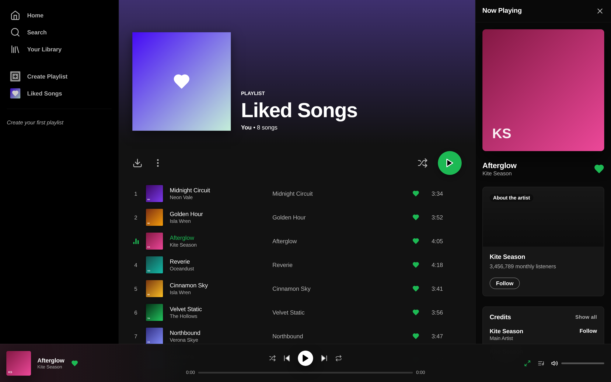 |

### Liked Songs & Library
Your saved tracks and everything you've collected in one place.

| Liked Songs | Your Library |
| :---: | :---: |
| 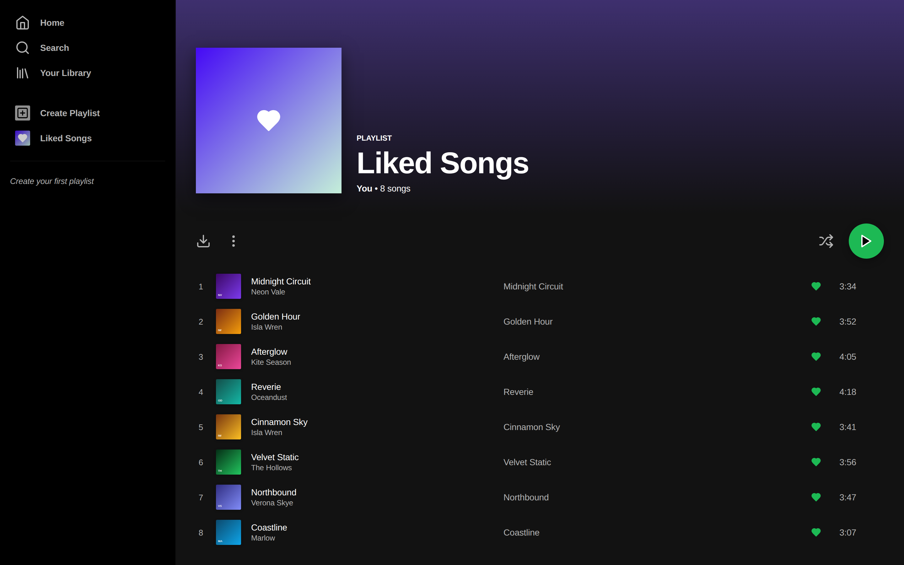 | 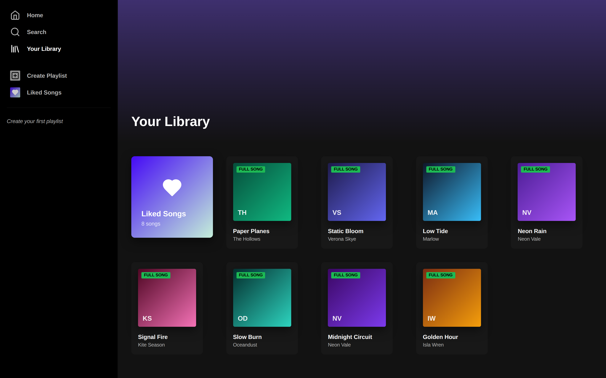 |

### Artist Page
Verified-artist header, monthly listeners and a popular-tracks list.

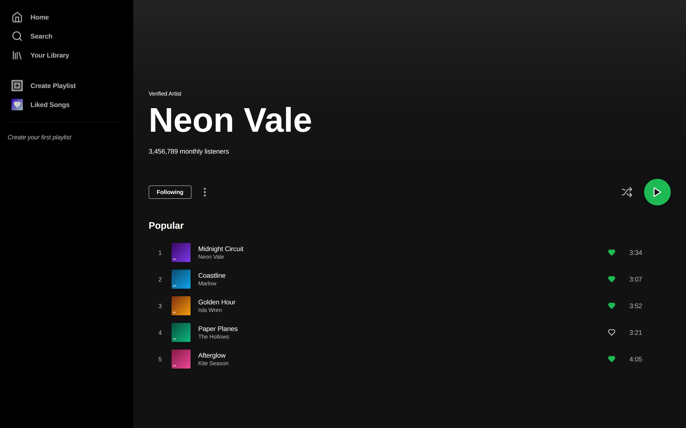

### AI DJ & Music DNA
Prompt-driven queue generation and an AI-styled analysis of your taste.

| AI DJ | Music DNA |
| :---: | :---: |
| 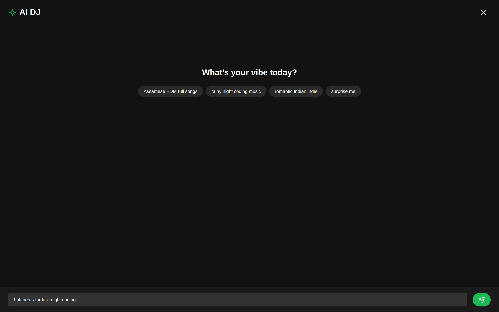 | 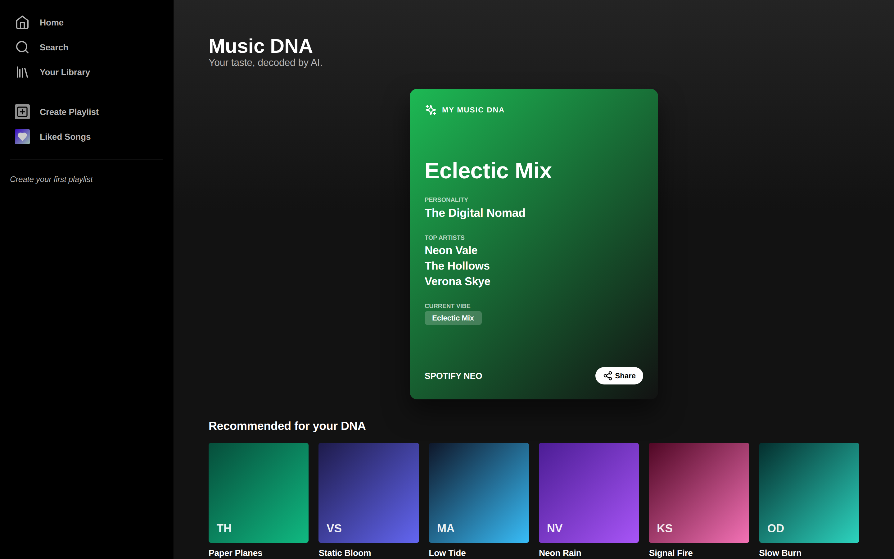 |

### Settings & Mobile
Granular playback/provider preferences, and the mobile-first responsive layout.

| Settings | Mobile |
| :---: | :---: |
| 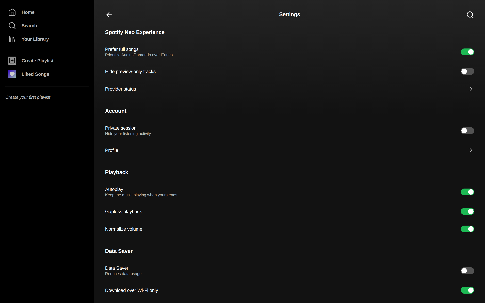 | 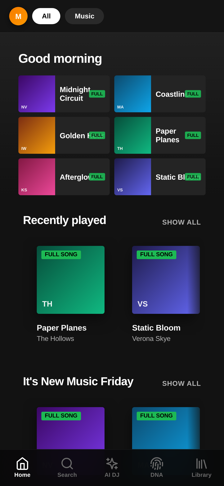 |

---

## 🧱 Tech Stack

| Area | Choice |
| --- | --- |
| UI | React 18 + TypeScript |
| State | Redux Toolkit (with localStorage persistence middleware) |
| Routing | React Router v6 |
| Styling | Sass / SCSS modules |
| Animation | Framer Motion |
| Icons | Lucide + React Icons |
| Data | Audius, Jamendo & iTunes public APIs (via Axios) |
| Tooling | Create React App, Playwright |

---

## 🏗️ Architecture

The app is organised around a provider-agnostic music service and a dedicated playback core.

```
src/
├── providers/        # Music sources behind a common interface
│   ├── AudiusProvider.ts
│   ├── JamendoProvider.ts
│   ├── iTunesProvider.ts
│   ├── localProvider.ts    # User playlists / local data
│   └── index.ts            # MusicService — searches all providers, ranks results
├── core/
│   ├── player/       # Playback controller + slice
│   ├── queue/        # Queue management + shuffle
│   └── persistence/  # Storage helpers
├── components/       # Player surfaces, cards, nav, sheets, rows…
│   ├── DesktopPlayer/  MiniPlayer/  FullPlayer/  NowPlayingPanel/
│   ├── Sidebar/  BottomNav/  BottomSheet/  CreateSheet/
│   └── MediaCard/  TrackRow/  HorizontalShelf/  AudioEngine.tsx
├── containers/       # Screens: Home, Search, Library, Playlist,
│                     #          Artist, MusicDna, AiDj, Settings
├── layouts/          # AppShell (sidebar + player + overlays)
├── services/         # aiService (AI DJ / DNA), persistenceService
├── store/            # Redux slices + persistence middleware
└── styles/           # Global SCSS
```

**How data flows:** each screen calls `musicService.search()`, which queries every provider with `Promise.allSettled`, normalises the results into a shared `MediaItem` shape, and prioritises full-song sources. Playback is driven through the queue + player core, so any surface (desktop, mobile, full-screen) reflects the same state. Likes, recently played and created playlists are persisted to `localStorage` and rehydrated on load.

---

## 🚀 Getting Started

**Prerequisites:** Node.js 18+ and npm.

```bash
# 1. Install dependencies
npm install

# 2. Start the dev server (http://localhost:3008)
npm start

# 3. Create a production build
npm run build
```

> The app talks to public music APIs (Audius / Jamendo / iTunes) directly from the browser — no API keys required to run it.

### Available scripts

| Script | What it does |
| --- | --- |
| `npm start` | Runs the app in development on port `3008` |
| `npm run build` | Produces an optimised production build in `build/` |
| `npm test` | Runs the test runner |
| `npm run build-css` | Compiles SCSS to CSS |
| `npm run watch-css` | Watches and recompiles SCSS |

---

## ⚙️ Configuration

Provider endpoints can be overridden with environment variables (e.g. `REACT_APP_AUDIUS_API_BASE`). Playback and provider preferences — prefer full songs, hide preview-only tracks, autoplay, gapless, normalize volume, data saver — are configurable in-app under **Settings**.

---

## 📦 Deployment

The project ships with configuration for static hosting (`netlify.toml`) and produces a standard CRA `build/` output that can be deployed to any static host.

---

<div align="center">

Built with 🖤 for music.

</div>
